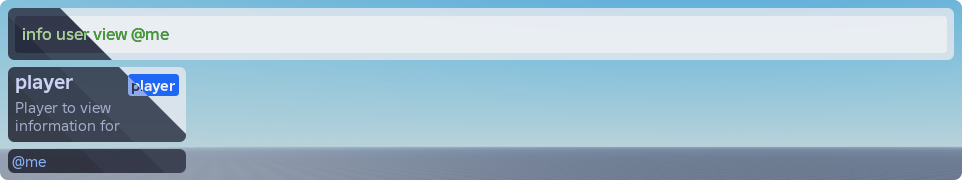

  

  <h1>Centurion</h1>

  

    <strong>A flexible and extensible command framework for roblox-ts</strong>
  

  [![CI status][ci-badge]][ci-url]
  [![npm latest version][npm-latest-badge]][npm-latest-url]
  [![npm dev version][npm-next-badge]][npm-next-url]

  [npm-latest-badge]: https://img.shields.io/npm/v/%40rbxts%2Fcommander?logo=npm&label=latest&color=green
  [npm-latest-url]: https://www.npmjs.com/package/@rbxts/commander/v/latest
  [npm-next-badge]: https://img.shields.io/npm/v/%40rbxts%2Fcommander%2Fnext?logo=npm&label=next
  [npm-next-url]: https://www.npmjs.com/package/@rbxts/commander/v/next
  [ci-badge]: https://github.com/paradoxuum/centurion/actions/workflows/ci.yml/badge.svg?branch=main
  [ci-url]: https://github.com/paradoxuum/centurion/actions/workflows/ci.yml

  <a href="https://centurion.paradoxum.dev/">📖 Documentation</a>

## About

Centurion is a command framework built for roblox-ts.

- Commands are defined using decorators in an easy and readable manner.
- Custom argument types can be created, allowing for a great deal of flexibility for your commands.
- Comes with an optional user interface which can easily be swapped out for a custom one.

## Attributions

-   [Cmdr](https://github.com/evaera/Cmdr): String utilities ([see usage](src/shared/util/string.ts))

-   [Flamework](https://github.com/rbxts-flamework/core): Metadata reflection API ([see usage](src/shared/util/reflect.ts))

-   [Slither](https://github.com/littensy/slither): Basic UI components and hooks
