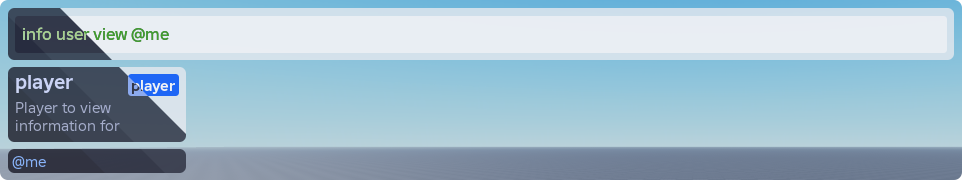

  

  <h1>Centurion</h1>

  
<strong>A flexible and extensible command framework for roblox-ts</strong>

  [![CI status][ci-badge]][ci-url]
  [![npm latest version][npm-latest-badge]][npm-latest-url]
  [![MIT License][license-badge]][license-url]

  [npm-latest-badge]: https://img.shields.io/npm/v/@rbxts/centurion.svg?style=for-the-badge&logo=npm
  [npm-latest-url]: https://www.npmjs.com/package/@rbxts/centurion/v/latest
  [ci-badge]: https://img.shields.io/github/actions/workflow/status/paradoxuum/centurion/ci.yml?style=for-the-badge&branch=main&logo=github
  [ci-url]: https://github.com/paradoxuum/centurion/actions/workflows/ci.yml
  [license-badge]: https://img.shields.io/github/license/paradoxuum/centurion?style=for-the-badge
  [license-url]: LICENSE.md

  

  [📖 **Documentation →**](https://centurion.paradoxum.dev/)

## ✨ Features

- ✏️ **Easy to use.** Centurion makes use of decorators to allow defining commands to be easy and readable.

- 💻 **User friendly.** Centurion offers a clean UI that provides suggestions, tab completion and more.

- 🚀 **Powerful.** Features like custom argument types and command guards allow for a wide range of flexibility.

- 🛠️ **Extensible.** Centurion's UI is optional and can easily be swapped out for a custom one.

## 💖 Attributions

- [🔥 Flamework](https://github.com/rbxts-flamework/core): Metadata reflection API ([see usage](packages/core/src/shared/core/metadata.ts))

- [🍀 Charm](https://github.com/littensy/charm): Command sync code

- [💻 Conch](https://github.com/alicesaidhi/conch): Basic UI components, text box handling

---

This project is released under the <a href="LICENSE.md">MIT License</a>.

